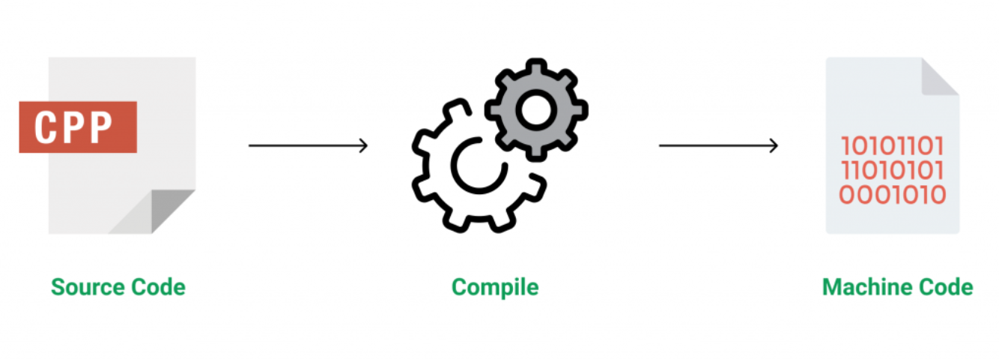

# C++  Programming Language 

* C++ also referred to as cpp and cxx is a general purpose programming language that was developed as an enhancement of the C language to include object oriented paradigm. 
* As of now , the language has far outgrown to be a multi-paradigm language with features of functional programming (Lamda Functions),object oriented programming(Classes and Objects), Imperative (C like features) and else. 
* It is a compiled language but also has a few compilers that are Just-in-Time compilers(JIT) .
  

C++ is a middle-level language rendering it the advantage of programming low-level (drivers, kernels) and even higher-level applications (games, GUI, desktop apps etc.). The basic syntax and code structure of both C and C++ are the same.

## Applications of C++ : 

1. Operating Systems and Systems Programming & Linux Based Distros
2. Browser Engines 
3. Graphics and Game Engines 
4. Rendering Engines like Skia in Flutter 
5. DataBase Engines 
6. Cloud/Distributed System 

## What I use it for : 

This was my first programming language that I learned in school and then after getting into college , I preferred to choose the cool C++ instead of the verbose and corporate looking Java. I tried to create some projects in it, but usually the projects in C++ are either very easy(Food Ordering System , College Database Systems ) or just too complex for the begineers (Game Engines, Graphic Rendering or Embedded Programming). I was hooked on this language for the sake of being a Software Developer but did not found any significant use in my college project. Later in the third year , I heard of this crap called Competitive Programming and how there were some kids banging their keyboard to get jobs in FAANG companies. So I usually use C++ for the sake of Competitive Programming and Leetcode , that I dont really like but I love the free food in Big Companies, thus learning it again and its advanced concepts. 

##Basic I/O : 

C++ comes with libraries that provide us many ways for performing input and output. In C++ input and output is performed in the form of a sequence of bytes or more commonly known as streams.

* **Input Stream: (cin)** If the direction of flow of bytes is from a device(for example Keyboard) to the main memory then this process is called input.

* **Output Stream: (cout)** If the direction of flow of bytes is opposite, i.e. from main memory to device( display screen ) then this process is called output.
* **Error Stream (cerr)** : There is also another stream in C++ that is used for sending error messages and logs 
  

## Header files available in C++ for Input - Output operation are:
iostream: iostream stands for standard input output stream. This header file contains definitions to objects like cin, cout, cerr etc.
iomanip: iomanip stands for input output manipulators. The methods declared in this files are used for manipulating streams. This file contains definitions of setw, setprecision etc.
fstream: This header file mainly describes the file stream. This header file is used to handle the data being read from a file as input or data being written into the file as output.
